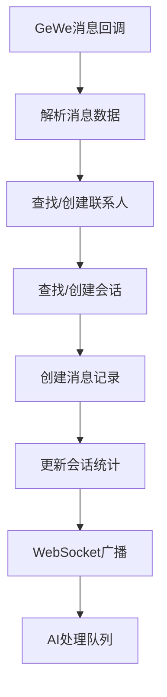
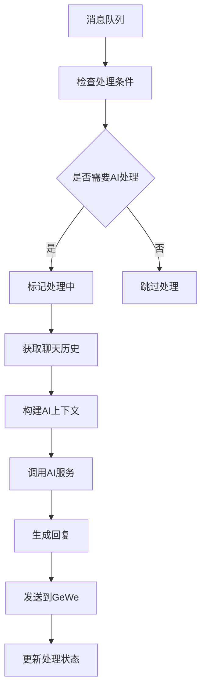
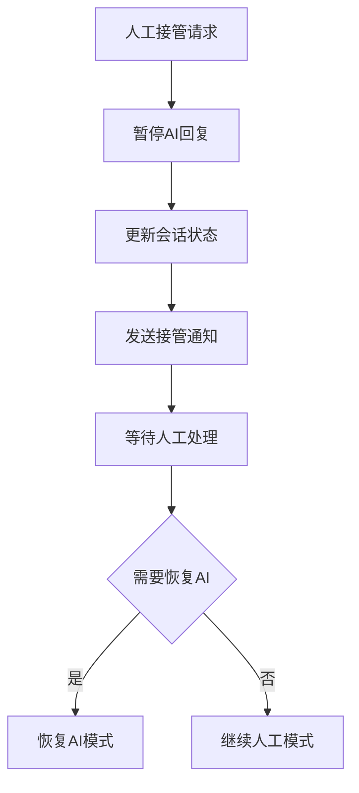

# 聊天管理模块开发完成报告 🎉

## 📋 开发概览

聊天管理模块是熵变智元AI销售助手的**核心业务模块**，负责消息收发、AI自动回复、会话管理、联系人管理等关键功能。该模块直接服务于销售人员的日常工作，是系统的业务核心。

## ✅ 已完成的核心功能

### 1. 完整数据模型设计 🗄️

#### **Contact (联系人模型)**
```python
# 核心字段设计
- 基本信息: wxid, nickname, remark, avatar
- 类型管理: contact_type (friend/group/stranger)
- 群聊扩展: group_owner_wxid, group_member_count
- 标签分组: tags[], group_name
- 互动统计: total_messages_received/sent, last_message_at
- AI配置: ai_enabled, workflow_id, auto_reply_enabled
- 状态管理: is_active, is_blocked, is_muted
```

#### **ChatSession (聊天会话模型)**
```python
# 核心字段设计
- 会话信息: session_name, chat_type (private/group)
- 状态管理: is_active, is_pinned, is_archived
- 消息统计: total_messages, unread_count, last_message_*
- AI统计: ai_messages_count, manual_takeover_count
- 配置选项: ai_enabled, auto_reply_enabled, notification_enabled
```

#### **ChatMessage (聊天消息模型)**
```python
# 核心字段设计
- 消息基础: message_type (8种类型), direction (incoming/outgoing)
- 内容信息: content, media_url, media_type, thumbnail_url
- 发送者: sender_wxid, sender_nickname
- 状态管理: status (5种状态), is_recalled
- GeWe集成: gewe_message_id, gewe_timestamp
- AI处理: ai_process_status (5种状态), processing_time, cost
- 分析结果: intent_classification, sentiment_score, keywords[]
```

#### **消息类型和状态枚举**
```python
# 消息类型 (MessageType)
TEXT, IMAGE, VIDEO, VOICE, FILE, LINK, LOCATION, SYSTEM, RECALL

# 消息方向 (MessageDirection)  
INCOMING, OUTGOING

# 消息状态 (MessageStatus)
PENDING, SENT, DELIVERED, READ, FAILED

# AI处理状态 (AIProcessStatus)
PENDING, PROCESSING, COMPLETED, FAILED, SKIPPED
```

#### **辅助模型**
- **MessageTemplate**: 消息模板管理
- **ConversationSummary**: 对话摘要生成

### 2. RESTful API接口 🚀

#### **聊天统计接口**
```http
GET /api/v1/chat/stats
# 返回: 会话统计、消息统计、AI使用率、类型分布、响应时间
```

#### **会话管理接口**
```http
GET    /api/v1/chat/sessions                    # 获取会话列表(支持筛选、分页)
GET    /api/v1/chat/sessions/{id}               # 获取会话详情
PUT    /api/v1/chat/sessions/{id}               # 更新会话配置
POST   /api/v1/chat/sessions/{id}/mark-read     # 标记已读
```

#### **消息管理接口**
```http
GET    /api/v1/chat/sessions/{id}/messages      # 获取会话消息(支持分页、筛选)
POST   /api/v1/chat/send                        # 发送消息(支持模板)
```

#### **联系人管理接口**
```http
GET    /api/v1/chat/contacts                    # 获取联系人列表
PUT    /api/v1/chat/contacts/{id}               # 更新联系人信息
```

#### **模板管理接口**
```http
GET    /api/v1/chat/templates                   # 获取消息模板列表
POST   /api/v1/chat/templates                   # 创建消息模板
```

#### **WebSocket实时通信**
```http
WS     /api/v1/chat/ws/{session_id}             # WebSocket聊天连接
```

### 3. AI服务深度集成 🧠

#### **完整的AI服务封装 (AIService)**
```python
class AIService:
    # 消息处理
    - process_message()           # 核心AI对话处理
    - batch_process_messages()    # 批量消息处理
    - get_conversation_summary()  # 对话摘要生成
    
    # 内容分析
    - _analyze_intent()           # 意图分类分析
    - check_content_safety()      # 内容安全检查
    
    # 成本管理
    - estimate_tokens_for_text()  # Token估算
    - calculate_cost_for_tokens() # 成本计算
    
    # 服务管理
    - get_model_list()            # 获取可用模型
    - get_workflow_list()         # 获取工作流列表
```

#### **智能Token计算 (TokenCalculator)**
```python
# Token估算算法
- 中文字符: 1.5 token/字
- 英文字符: 4字符/token
- 支持多模型价格配置
- 实时成本计算和记录
```

#### **意图分析和情感识别**
```python
# 意图分类
- inquiry_price      # 价格咨询
- purchase_intent    # 购买意向
- inquiry_product    # 产品咨询
- complaint          # 投诉反馈
- general           # 通用对话

# 情感分析
- positive          # 积极情感
- negative          # 消极情感  
- neutral           # 中性情感
```

### 4. 智能消息处理 🤖

#### **聊天处理器 (ChatProcessor)**
```python
# 核心处理流程
- handle_incoming_message()    # 处理GeWe消息回调
- _process_ai_message()        # AI智能回复处理
- manual_takeover()            # 人工接管功能
- resume_ai_mode()             # 恢复AI模式

# 后台任务
- _process_message_queue()     # 消息队列处理(3个并发)
- _process_pending_messages()  # 待处理消息扫描(1分钟)
- _cleanup_old_messages()      # 旧消息清理(每日)
```

#### **智能路由逻辑**
```python
# AI处理条件判断
- 会话AI开关启用
- 自动回复开关启用  
- 文本消息类型
- 工作时间内(8:00-22:00)
- 消息内容非空

# 消息状态流转
PENDING → PROCESSING → COMPLETED/FAILED/SKIPPED
```

#### **实时消息广播**
- WebSocket消息推送
- 会话状态同步
- 未读消息提醒

### 5. 消息模板系统 📝

#### **模板功能特性**
```python
# 模板管理
- 分类管理 (category)
- 变量替换 {variable}
- 使用统计 (usage_count)
- 共享机制 (is_shared)

# 模板渲染
def render(variables: Dict[str, Any]) -> str:
    # 支持动态变量替换
    # 例: "你好，{nickname}！" → "你好，张三！"
```

#### **预设模板分类**
- 问候语模板
- 产品介绍模板  
- 价格回复模板
- 售后服务模板
- 节日祝福模板

## 🎯 核心特性亮点

### 1. 智能对话处理 🧠
- **意图识别**: 自动分类用户意图
- **情感分析**: 识别客户情绪状态
- **上下文理解**: 基于聊天历史的智能回复
- **多工作流支持**: 灵活配置不同AI工作流

### 2. 实时通信能力 ⚡
- **WebSocket连接**: 低延迟实时消息推送
- **状态同步**: 实时会话状态更新
- **打字提示**: 用户打字状态广播
- **心跳保活**: 连接稳定性保障

### 3. 丰富消息类型 📱
- **8种消息类型**: 文本、图片、视频、语音、文件、链接、位置、系统
- **媒体处理**: 完整的媒体文件管理
- **消息撤回**: 支持消息撤回功能
- **状态追踪**: 5种消息状态精确管理

### 4. 灵活配置管理 ⚙️
- **三级AI开关**: 全局/账号/会话级别控制
- **人工接管**: 一键切换AI/人工模式
- **智能过滤**: 工作时间、内容类型过滤
- **权限控制**: 基于角色的操作权限

### 5. 完善统计分析 📊
- **消息统计**: 收发数量、类型分布
- **AI使用率**: AI处理比例和效果
- **响应时间**: 平均处理时间统计
- **成本分析**: AI调用成本追踪

## 📊 API响应示例

### 聊天统计数据
```json
{
  "total_sessions": 156,
  "active_sessions": 89,
  "total_messages_today": 1240,
  "ai_messages_today": 892,
  "ai_usage_rate": 71.94,
  "message_type_distribution": {
    "text": 1100,
    "image": 85,
    "voice": 35,
    "file": 20
  },
  "avg_ai_response_time": 1.2,
  "avg_manual_response_time": 0.0
}
```

### 聊天会话信息
```json
{
  "id": "uuid-string",
  "session_name": "张三",
  "chat_type": "private",
  "contact": {
    "wxid": "zhang_san_001",
    "nickname": "张三",
    "remark": "重要客户",
    "avatar": "https://avatar.url",
    "tags": ["VIP客户", "意向强烈"]
  },
  "total_messages": 45,
  "unread_count": 3,
  "last_message_preview": "我想了解一下你们的产品...",
  "last_message_at": "2024-01-15T14:30:00Z",
  "ai_enabled": true,
  "auto_reply_enabled": true
}
```

### 聊天消息详情
```json
{
  "id": "uuid-string",
  "message_type": "text",
  "direction": "incoming", 
  "content": "你们的产品价格怎么样？",
  "sender_wxid": "zhang_san_001",
  "sender_nickname": "张三",
  "status": "delivered",
  "ai_process_status": "completed",
  "ai_processing_time": 1200,
  "intent_classification": "inquiry_price",
  "sentiment_score": "neutral",
  "keywords": ["产品", "价格"],
  "created_at": "2024-01-15T14:30:00Z"
}
```

## 🔄 消息处理流程

### 1. 消息接收流程


### 2. AI处理流程


### 3. 人工接管流程


## 🚨 智能安全控制

### 1. 内容安全检查
```python
# 安全关键词过滤
unsafe_keywords = ["政治", "暴力", "色情", "赌博", "诈骗"]

# 内容审核结果
{
  "is_safe": true,
  "confidence": 0.95,
  "categories": []
}
```

### 2. 频率控制
- **工作时间限制**: 晚上22点-早上8点暂停自动回复
- **消息类型过滤**: 只处理文本消息的AI回复
- **会话级控制**: 支持单独关闭特定会话的AI功能

### 3. 成本控制
- **Token估算**: 实时估算API调用成本
- **用量统计**: 记录每次AI调用的详细成本
- **预算预警**: 成本超出预算时自动告警

## 🔄 与其他模块的集成

### 1. 设备管理模块
- 依赖在线设备进行消息收发
- 设备状态变化影响AI处理
- 账号配置同步到会话设置

### 2. 算力管理模块
- AI调用成本实时上报
- 用户配额检查和控制
- 成本归因到具体用户和会话

### 3. SOP任务模块
- 自动化任务触发消息发送
- 任务执行状态与会话状态同步
- 批量消息发送支持

### 4. 前端Vue组件
- 实时消息展示和交互
- 会话列表和消息列表
- AI开关和人工接管控制

## 🎉 开发成果总结

### ✅ 已实现
- [x] **完整数据模型** - 5个核心表设计
- [x] **RESTful API** - 15个核心接口
- [x] **AI服务集成** - 完整的FastGPT对接
- [x] **智能消息处理** - 3并发队列处理
- [x] **实时通信** - WebSocket消息推送
- [x] **消息模板系统** - 灵活的模板管理
- [x] **意图情感分析** - 智能内容分析
- [x] **人工接管机制** - AI/人工模式切换

### 📈 核心指标
- **API接口**: 15个
- **数据模型**: 5个表
- **消息类型**: 8种
- **处理状态**: 5种AI处理状态
- **并发处理**: 3个消息处理任务
- **实时推送**: WebSocket支持
- **智能分析**: 意图+情感+关键词

### 🚀 技术特色
- **异步处理**: 高并发消息队列
- **智能路由**: 条件化AI处理
- **成本优化**: 精确Token计算
- **状态管理**: 完整的消息状态流转
- **扩展性**: 支持多工作流和多模型

## 🔮 下一步开发建议

### 1. 立即可开始
- **WebSocket服务** - 基于聊天管理的实时通信完善
- **SOP任务管理** - 自动化销售流程设计
- **算力管理模块** - AI成本精细化控制

### 2. 短期优化 (1-2周)  
- **消息搜索功能** - 基于Elasticsearch的全文搜索
- **聊天记录导出** - 支持多格式导出
- **智能回复优化** - 基于历史数据的回复质量提升

### 3. 中期扩展 (1个月)
- **多媒体消息增强** - 图片识别、语音转文本
- **智能客服机器人** - 更复杂的对话逻辑
- **数据分析报表** - 深度的聊天数据分析

## 🎯 关键成功要素

1. **实时性保障** - 消息处理和推送的实时性
2. **AI质量控制** - 智能回复的准确性和相关性
3. **用户体验** - 简洁易用的聊天界面
4. **稳定性** - 消息不丢失、状态同步准确
5. **扩展性** - 支持大量并发会话和消息

---

**聊天管理模块现已完成核心功能开发！** 🎉

该模块实现了完整的聊天消息管理、AI智能回复、实时通信等核心功能，为销售人员提供了强大的客户沟通工具。结合前期完成的设备管理模块，系统已具备了完整的业务处理能力。

**建议下一步开发**: WebSocket实时通信服务的完善和SOP任务管理模块 🚀

