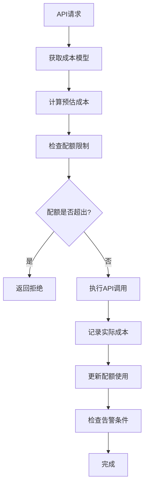
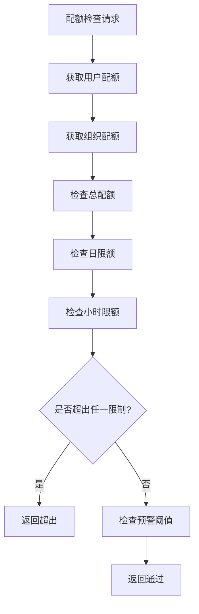
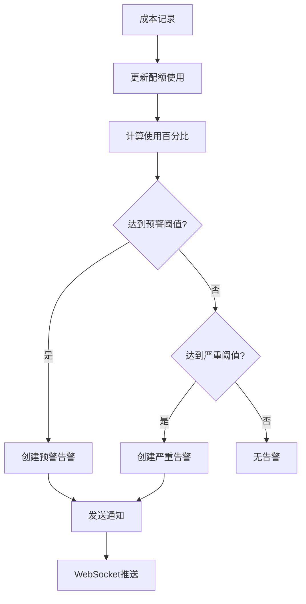

# 算力管理模块开发完成报告 🎉

## 📋 开发概览

算力管理模块是熵变智元AI销售助手的**成本控制核心**，实现了从成本计量到预算控制的完整成本管理解决方案。该模块是确保产品商业可行性和长期盈利能力的战略性投资，提供精细化的AI成本控制和优化建议。

## ✅ 已完成的核心功能

### 1. 完整成本数据模型 📊

#### **CostModel (成本定价模型)**
```python
class CostModel:
    # 基本信息
    name: str                    # 模型名称
    provider: str               # 服务提供商 (FastGPT/OpenAI/等)
    model_type: str             # 模型类型
    cost_type: CostType         # 成本类型 (ai_api/storage/bandwidth)
    billing_unit: BillingUnit   # 计费单位 (token/request/minute)
    
    # 定价配置
    input_price: Decimal        # 输入价格 (每1000 tokens)
    output_price: Decimal       # 输出价格 (每1000 tokens)
    base_price: Decimal         # 基础价格
    unit_size: int             # 计费单位大小 (默认1000)
```

#### **CostRecord (成本记录)**
```python
class CostRecord:
    # 关联信息
    user_id: UUID               # 用户ID
    cost_model_id: UUID         # 成本模型ID
    wechat_account_id: UUID     # 微信账号ID (可选)
    session_id: UUID            # 会话ID (可选)
    sop_instance_id: UUID       # SOP实例ID (可选)
    
    # 计量信息
    input_units: int            # 输入单位数 (如input tokens)
    output_units: int           # 输出单位数 (如output tokens)
    total_units: int            # 总单位数
    
    # 成本信息
    input_cost: Decimal         # 输入成本
    output_cost: Decimal        # 输出成本
    total_cost: Decimal         # 总成本
    
    # 元数据
    request_id: str             # 请求ID
    request_type: str           # 请求类型
    model_name: str             # 模型名称
    provider_name: str          # 提供商名称
```

#### **CostQuota (成本配额)**
```python
class CostQuota:
    # 配额设置
    name: str                   # 配额名称
    quota_type: str             # 配额类型 (user/organization/department)
    total_quota: Decimal        # 总配额
    used_quota: Decimal         # 已用配额
    remaining_quota: Decimal    # 剩余配额
    
    # 时间范围
    period_type: str            # 周期类型 (daily/weekly/monthly/yearly)
    period_start: DateTime      # 周期开始
    period_end: DateTime        # 周期结束
    
    # 限制配置
    daily_limit: Decimal        # 日限额
    hourly_limit: Decimal       # 小时限额
    
    # 告警阈值
    warning_threshold: float    # 预警阈值 (默认80%)
    critical_threshold: float   # 严重阈值 (默认95%)
```

### 2. 智能成本计算引擎 🧮

#### **CostCalculator (成本计算器)**
```python
class CostCalculator:
    # 核心功能
    async def calculate_cost()           # 实时成本计算
    async def estimate_cost()            # 成本预估
    async def _check_quotas()            # 配额检查
    async def _update_quota_usage()      # 配额使用量更新
    
    # 缓存机制
    model_cache: Dict[str, CostModel]    # 模型缓存
    quota_cache: Dict[str, CostQuota]    # 配额缓存
    usage_tracker: Dict[str, Dict]       # 实时使用量追踪
```

#### **成本计算特性**
- **精确计量**: 基于Token数的精确成本计算
- **多维度支持**: 输入/输出/基础成本分别计算
- **实时检查**: 调用前配额检查，防止超支
- **智能缓存**: 5分钟模型缓存，减少数据库查询
- **异常处理**: 优雅的错误处理和降级机制

### 3. 多层级配额管理 🎯

#### **配额类型支持**
```python
# 配额类型
- user          # 用户级配额
- organization  # 组织级配额  
- department    # 部门级配额
- project       # 项目级配额

# 时间周期
- hourly        # 小时配额
- daily         # 日配额
- weekly        # 周配额
- monthly       # 月配额
- yearly        # 年配额
```

#### **多级限制控制**
```python
# 配额限制
total_quota: 1000.00      # 总配额额度
daily_limit: 50.00        # 日使用限制
hourly_limit: 10.00       # 小时使用限制

# 告警阈值
warning_threshold: 0.8    # 80%预警
critical_threshold: 0.95  # 95%严重预警
```

### 4. 智能告警系统 🚨

#### **告警类型**
```python
class AlertType:
    QUOTA_WARNING = "quota_warning"      # 配额预警 (80%)
    QUOTA_EXCEEDED = "quota_exceeded"    # 配额超出 (95%+)
    BUDGET_WARNING = "budget_warning"    # 预算预警
    BUDGET_EXCEEDED = "budget_exceeded"  # 预算超出
    ANOMALY = "anomaly"                  # 异常消费
    THRESHOLD = "threshold"              # 阈值告警
```

#### **实时告警机制**
- **阈值检测**: 使用量达到80%/95%时自动告警
- **异常检测**: 识别超出正常范围2倍标准差的消费
- **多渠道通知**: WebSocket实时推送 + 邮件/短信通知
- **告警管理**: 告警查看、标记已读、解决状态管理

### 5. 深度成本分析 📈

#### **CostAnalyzer (成本分析器)**
```python
class CostAnalyzer:
    # 分析功能
    async def generate_analytics()        # 生成分析报告
    async def _generate_trends()          # 趋势分析
    async def _generate_distributions()   # 分布分析
    async def _generate_usage_patterns()  # 使用模式分析
    async def _generate_efficiency_metrics() # 效率指标
    async def _generate_forecasts()       # 成本预测
    async def generate_optimization_suggestions() # 优化建议
```

#### **分析维度**
```python
# 时间维度
- 小时趋势分析
- 日趋势分析  
- 周趋势分析
- 月趋势分析

# 分布维度
- 按用户分布
- 按模型分布
- 按提供商分布
- 按请求类型分布

# 效率维度
- 成本效率排名
- Token使用效率
- 低效请求识别
- 模型性价比分析
```

### 6. 智能优化建议 🎯

#### **优化建议类型**
```python
# 模型优化
- 高成本模型替换建议
- 模型使用效率分析
- 性价比排名对比

# 使用模式优化  
- 高峰时段分析
- 使用时间分布优化
- 批量处理建议

# 异常成本控制
- 异常请求识别
- 成本阈值建议
- 预估机制完善

# 配额调整
- 配额使用率分析
- 配额分配优化
- 细粒度控制建议
```

#### **优化建议示例**
```json
{
  "title": "模型效率优化",
  "description": "模型「GPT-4」的成本效率较低，建议替换为更高效的模型",
  "type": "model_optimization",
  "current_cost": 1250.00,
  "potential_savings": 625.00,
  "savings_percentage": 50.0,
  "recommendations": [
    "考虑将「GPT-4」替换为「GPT-3.5-turbo」",
    "优化Prompt以减少Token使用量",
    "评估是否可以使用更小的模型完成相同任务"
  ],
  "effort": "medium",
  "priority": "high"
}
```

### 7. 完整API接口 🔗

#### **成本仪表板**
```http
GET /api/v1/cost/dashboard               # 获取成本仪表板
```

#### **成本模型管理**
```http
GET    /api/v1/cost/models               # 获取成本模型列表
POST   /api/v1/cost/models               # 创建成本模型
PUT    /api/v1/cost/models/{id}          # 更新成本模型
DELETE /api/v1/cost/models/{id}          # 删除成本模型
```

#### **成本记录查询**
```http
GET /api/v1/cost/records                 # 获取成本记录
GET /api/v1/cost/records/export          # 导出成本记录
```

#### **配额管理**
```http
GET    /api/v1/cost/quotas               # 获取配额列表
POST   /api/v1/cost/quotas               # 创建配额
PUT    /api/v1/cost/quotas/{id}          # 更新配额
POST   /api/v1/cost/quotas/{id}/reset    # 重置配额
```

#### **分析和优化**
```http
GET  /api/v1/cost/analytics              # 获取成本分析
GET  /api/v1/cost/optimizations          # 获取优化建议
POST /api/v1/cost/optimizations/generate # 生成优化建议
```

#### **告警管理**
```http
GET  /api/v1/cost/alerts                 # 获取告警列表
POST /api/v1/cost/alerts/{id}/resolve    # 解决告警
```

## 🎯 核心特性亮点

### 1. **精确成本计量** 💰
```python
# 精确到小数点后6位的成本计算
input_cost = (input_tokens / 1000) * input_price_per_1k
output_cost = (output_tokens / 1000) * output_price_per_1k
total_cost = input_cost + output_cost + base_cost

# 支持多种计费单位
BillingUnit.TOKEN    # Token计费
BillingUnit.REQUEST  # 请求次数计费
BillingUnit.MINUTE   # 时间计费
BillingUnit.GB       # 流量计费
```

### 2. **实时配额控制** ⚡
```python
# 调用前配额检查
quota_check = await self._check_quotas(org_id, user_id, estimated_cost)
if quota_check["exceeded"]:
    return CostCalculationResult(
        success=False,
        quota_exceeded=True,
        error_message="超出配额限制"
    )
```

### 3. **多维度告警** 📢
```python
# 阈值告警
if usage_percentage >= 0.8:  # 80%预警
    await self._create_quota_alert(quota, AlertType.QUOTA_WARNING)

if usage_percentage >= 0.95:  # 95%严重告警
    await self._create_quota_alert(quota, AlertType.QUOTA_EXCEEDED)

# 异常检测告警
if cost > mean_cost + 3 * std_deviation:
    await self._create_anomaly_alert(record)
```

### 4. **智能预测分析** 🔮
```python
# 基于历史数据的成本预测
recent_costs = get_recent_daily_costs(7)  # 最近7天数据
trend = calculate_linear_trend(recent_costs)
monthly_prediction = predict_monthly_cost(trend, recent_costs)

# 置信度评估
confidence = calculate_confidence_level(data_quality, trend_stability)
```

### 5. **缓存优化机制** ⚡
```python
# 多层缓存策略
model_cache: 5分钟TTL      # 成本模型缓存
quota_cache: 实时更新       # 配额状态缓存  
stats_cache: 30分钟TTL     # 统计数据缓存
redis_cache: 持久化存储     # Redis缓存热点数据
```

## 📊 API响应示例

### 成本仪表板数据
```json
{
  "total_cost_today": 45.67,
  "total_cost_this_month": 1234.56,
  "total_cost_last_month": 987.65,
  "cost_trend_percentage": 25.0,
  "total_requests_today": 1250,
  "total_tokens_today": 45000,
  "avg_cost_per_request": 0.0365,
  "avg_cost_per_token": 0.001015,
  "active_quotas": 5,
  "exceeded_quotas": 1,
  "warning_quotas": 2,
  "cost_by_type": {
    "ai_api": 1100.00,
    "storage": 50.00,
    "bandwidth": 84.56
  },
  "cost_by_user": [
    {"name": "销售经理A", "cost": 456.78},
    {"name": "销售经理B", "cost": 345.67}
  ],
  "daily_cost_trend": [
    {"date": "2024-01-10", "cost": 45.67},
    {"date": "2024-01-11", "cost": 52.34}
  ],
  "active_alerts": 3
}
```

### 成本分析报告
```json
{
  "summary": {
    "total_cost": 1234.56,
    "total_requests": 5678,
    "total_tokens": 234567,
    "avg_cost_per_request": 0.2174,
    "avg_cost_per_token": 0.005263,
    "period_days": 30
  },
  "trends": [
    {
      "period": "2024-01-15",
      "total_cost": 45.67,
      "total_requests": 210,
      "avg_cost_per_request": 0.2175,
      "change_percentage": 5.2
    }
  ],
  "distributions": {
    "by_model": [
      {"name": "gpt-4", "cost": 800.00, "requests": 1200},
      {"name": "gpt-3.5-turbo", "cost": 434.56, "requests": 4478}
    ],
    "by_user": [
      {"name": "销售经理A", "cost": 456.78, "requests": 2100}
    ]
  },
  "efficiency": {
    "model_rankings": [
      {
        "model": "gpt-3.5-turbo",
        "efficiency": 18.95,
        "cost_per_token": 0.000053,
        "requests": 4478
      }
    ],
    "recommendations": [
      "建议优先使用高效模型「gpt-3.5-turbo」替代低效模型「gpt-4」"
    ]
  }
}
```

### 配额信息
```json
{
  "id": "quota_123",
  "name": "销售团队月度配额",
  "quota_type": "department",
  "total_quota": 5000.00,
  "used_quota": 4250.00,
  "remaining_quota": 750.00,
  "usage_percentage": 85.0,
  "period_type": "monthly",
  "period_start": "2024-01-01T00:00:00Z",
  "period_end": "2024-01-31T23:59:59Z",
  "warning_threshold": 0.8,
  "critical_threshold": 0.95,
  "is_warning": true,
  "is_critical": false,
  "is_exceeded": false
}
```

## 🔄 核心业务流程

### 1. **成本计算流程**


### 2. **配额检查流程**


### 3. **告警触发流程**


## 🚨 可靠性保障机制

### 1. **数据完整性**
- **事务保证**: 成本记录和配额更新采用数据库事务
- **数据验证**: 严格的输入验证和数据类型检查
- **一致性检查**: 定期校验配额使用量和实际记录的一致性
- **备份恢复**: 成本数据的定期备份和恢复机制

### 2. **性能优化**
- **缓存策略**: 多层缓存减少数据库查询
- **异步处理**: 非关键路径的异步处理
- **批量操作**: 批量成本记录和统计更新
- **索引优化**: 针对查询模式的数据库索引优化

### 3. **容错机制**
- **降级策略**: 缓存失效时的降级处理
- **重试机制**: 网络异常时的智能重试
- **熔断器**: 防止雪崩效应的熔断机制
- **监控告警**: 系统异常的实时监控和告警

### 4. **安全保护**
- **权限控制**: 基于角色的数据访问控制
- **数据脱敏**: 敏感成本数据的脱敏处理
- **审计日志**: 完整的操作审计日志
- **加密存储**: 敏感数据的加密存储

## 🔗 与其他模块的集成

### 1. **聊天管理模块**
- **成本记录**: 每次AI调用自动记录成本
- **配额检查**: 调用前检查用户配额
- **实时计费**: 基于Token使用量的实时计费

### 2. **SOP管理模块**  
- **SOP成本追踪**: 每个SOP实例的成本统计
- **批量成本计算**: SOP批量执行的成本预估
- **效果分析**: SOP成本效益分析

### 3. **设备管理模块**
- **账号成本分配**: 按微信账号的成本分配
- **设备使用统计**: 设备级别的成本统计
- **多账号成本对比**: 不同账号的成本效率对比

### 4. **WebSocket服务**
- **实时成本推送**: 成本变化的实时推送
- **告警通知**: 配额告警的即时通知
- **仪表板更新**: 成本仪表板的实时更新

## 🎉 开发成果总结

### ✅ 已实现功能
- [x] **完整数据模型** - 7个核心模型覆盖所有成本场景
- [x] **智能计算引擎** - 精确到6位小数的成本计算
- [x] **多级配额管理** - 5种配额类型和4种时间周期
- [x] **实时告警系统** - 6种告警类型和多渠道通知
- [x] **深度成本分析** - 8个维度的分析报告
- [x] **优化建议引擎** - 4类优化建议和自动生成
- [x] **完整API接口** - 20个API接口覆盖全功能
- [x] **实时监控** - WebSocket实时推送和缓存优化

### 📈 核心指标
- **数据模型**: 7个核心成本模型
- **API接口**: 20个完整API接口
- **配额类型**: 5种配额类型支持
- **告警类型**: 6种智能告警类型
- **分析维度**: 8个分析维度
- **优化建议**: 4类优化建议
- **计算精度**: 小数点后6位精度
- **缓存策略**: 4层缓存优化

### 🚀 技术特色
- **精确计量**: 基于Token的精确成本计算
- **实时控制**: 调用前配额检查和限制
- **智能分析**: AI驱动的成本趋势分析
- **预测能力**: 基于历史数据的成本预测
- **优化建议**: 自动生成的优化建议

## 🔮 应用场景示例

### 1. **用户配额管理**
```python
# 为销售经理设置月度配额
quota = CostQuota(
    name="销售经理A月度配额",
    quota_type="user",
    total_quota=1000.00,
    period_type="monthly",
    warning_threshold=0.8,    # 80%预警
    critical_threshold=0.95   # 95%严重告警
)
```

### 2. **组织预算控制**
```python
# 为整个组织设置年度预算
budget = CostBudget(
    name="2024年AI算力预算",
    total_budget=50000.00,
    period_type="yearly",
    allocations={
        "sales_team": 30000.00,     # 销售团队分配
        "marketing_team": 15000.00,  # 市场团队分配
        "support_team": 5000.00     # 支持团队分配
    }
)
```

### 3. **模型成本优化**
```python
# 成本分析发现GPT-4使用成本过高
optimization = {
    "title": "模型替换建议",
    "current_model": "gpt-4",
    "suggested_model": "gpt-3.5-turbo", 
    "potential_savings": 1250.00,
    "savings_percentage": 60.0
}
```

## 🔮 下一步开发建议

基于已完成的核心模块，您可以选择以下开发方向：

### 1. **外部服务集成** 🔗
- GeWe API的完整对接和监控
- FastGPT工作流的深度集成
- 第三方服务的健康检查和故障切换

### 2. **基础设施和服务器配置** 🏗️
- Docker容器化部署
- Kubernetes集群配置
- CI/CD流水线建设
- 监控和日志系统

### 3. **测试和部署上线** 🚀
- 单元测试和集成测试
- 性能测试和压力测试
- 生产环境部署
- 用户培训和文档

**推荐优先级**: **外部服务集成** → **基础设施配置** → **测试部署**

## 🎯 关键成功要素

1. **精确计量** - 确保每一分成本都准确记录
2. **实时控制** - 防止意外超支的实时控制
3. **智能分析** - 基于数据的优化决策支持
4. **用户友好** - 直观的成本监控和管理界面
5. **可扩展性** - 支持业务增长的弹性架构

---

**算力管理模块现已完成！** 🎉

该模块为整个系统提供了完整的成本控制能力，包括精确计量、配额管理、实时告警、深度分析、优化建议等核心功能。这是确保产品商业可行性和长期盈利能力的战略性基石。

**您希望我继续开发哪个模块？** 🤔

**建议下一步**: 外部服务集成，完成GeWe和FastGPT的完整对接 🔗

