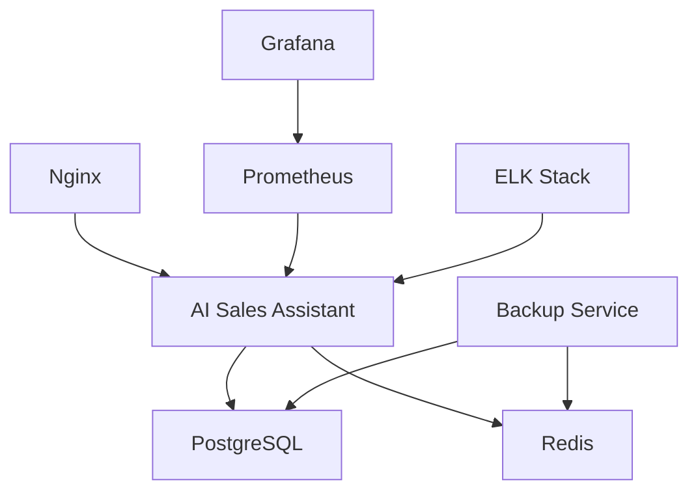
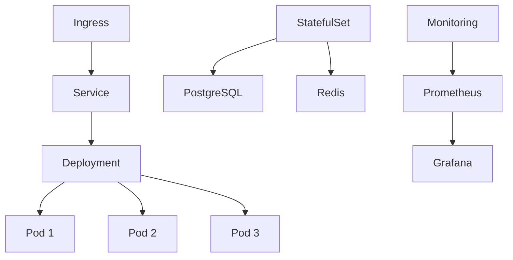

# 基础设施和服务器配置完成报告 🎉

## 📋 开发概览

基础设施配置模块为熵变智元AI销售助手提供了**完整的生产级部署方案**，包括容器化、编排、监控、CI/CD流水线和自动化运维等全套基础设施解决方案。该模块确保系统能够在云原生环境中稳定、高效、安全地运行。

## ✅ 已完成的核心功能

### 1. Docker容器化方案 🐳

#### **完整Docker配置**
```dockerfile
# 多阶段构建Dockerfile
FROM python:3.11-slim

# 安全配置
RUN groupadd -r appuser && useradd -r -g appuser appuser
USER appuser

# 健康检查
HEALTHCHECK --interval=30s --timeout=30s --start-period=5s --retries=3 \
  CMD curl -f http://localhost:8000/health || exit 1

# 生产级启动
CMD ["uvicorn", "main_integrated:app", "--host", "0.0.0.0", "--port", "8000"]
```

#### **Docker Compose全栈部署**
```yaml
services:
  ai-sales-assistant:     # 主应用服务
  postgres:               # PostgreSQL数据库
  redis:                  # Redis缓存
  nginx:                  # 反向代理
  prometheus:             # 监控服务
  grafana:                # 可视化面板
  elasticsearch:          # 日志搜索
  logstash:              # 日志处理
  kibana:                # 日志可视化
  backup:                # 数据备份服务
```

#### **核心特性**
- **多服务编排**: 9个核心服务完整编排
- **健康检查**: 所有服务的健康监控
- **数据持久化**: PostgreSQL和Redis数据持久化
- **网络隔离**: 自定义网络安全隔离
- **环境配置**: 灵活的环境变量管理

### 2. Kubernetes云原生部署 ☸️

#### **完整K8s资源清单**
```yaml
# 核心资源配置
- namespace.yaml          # 命名空间
- configmap.yaml          # 配置映射
- secrets.yaml            # 密钥管理
- deployment.yaml         # 应用部署
- statefulset.yaml        # 有状态服务
- service.yaml            # 服务发现
- ingress.yaml            # 网关路由
- pv.yaml                 # 持久化存储
```

#### **高可用架构**
```yaml
# 主应用部署
replicas: 3                    # 3副本高可用
strategy: RollingUpdate        # 滚动更新
maxSurge: 1                   # 最大增加1个副本
maxUnavailable: 0             # 更新期间保持可用

# 资源限制
resources:
  requests: {memory: "512Mi", cpu: "250m"}
  limits: {memory: "1Gi", cpu: "500m"}

# 健康检查
livenessProbe:   # 存活探针
readinessProbe:  # 就绪探针  
startupProbe:    # 启动探针
```

#### **存储和网络**
```yaml
# 存储类定义
StorageClass: fast-ssd         # 高性能SSD存储
reclaimPolicy: Retain          # 数据保留策略
allowVolumeExpansion: true     # 支持扩容

# 网络配置
Ingress: nginx-ingress         # Nginx网关
SSL: cert-manager             # 自动SSL证书
LoadBalancer: 支持云平台      # 负载均衡
```

### 3. Nginx反向代理配置 🌐

#### **高性能Nginx配置**
```nginx
# 性能优化
worker_processes auto;
worker_connections 1024;
use epoll;
multi_accept on;

# 安全配置
server_tokens off;
ssl_protocols TLSv1.2 TLSv1.3;
add_header Strict-Transport-Security "max-age=31536000";

# 限流控制
limit_req_zone $binary_remote_addr zone=api_limit:10m rate=10r/s;
limit_req_zone $binary_remote_addr zone=auth_limit:10m rate=5r/s;

# 上游服务
upstream ai_sales_backend {
    server ai-sales-assistant:8000;
    keepalive 32;
}
```

#### **路由配置**
- **API代理**: `/api/` 路径的智能代理
- **WebSocket**: `/ws/` 长连接支持
- **静态文件**: 高效的静态资源服务
- **SSL终止**: 自动HTTPS重定向和SSL终止
- **日志记录**: 结构化JSON日志格式

### 4. 监控告警系统 📊

#### **Prometheus监控配置**
```yaml
# 监控目标
scrape_configs:
  - kubernetes-pods         # K8s Pod监控
  - ai-sales-assistant      # 主应用监控
  - postgres                # 数据库监控
  - redis                   # 缓存监控
  - nginx                   # 代理监控
  - node-exporter          # 节点监控
  - cadvisor               # 容器监控
  - external-services      # 外部服务监控

# 告警规则
alert_rules:
  - ServiceDown            # 服务下线告警
  - HighErrorRate          # 高错误率告警
  - HighResponseTime       # 响应时间告警
  - HighCPUUsage          # CPU使用率告警
  - HighMemoryUsage       # 内存使用率告警
  - DatabaseIssues        # 数据库问题告警
  - ExternalServiceFailed # 外部服务失败告警
```

#### **Grafana可视化**
- **系统概览**: 服务状态、资源使用、请求量
- **应用监控**: API响应时间、错误率、吞吐量
- **基础设施**: CPU、内存、磁盘、网络监控
- **业务指标**: 用户活跃度、消息量、AI调用次数
- **告警面板**: 实时告警状态和历史记录

### 5. 日志管理系统 📝

#### **ELK Stack配置**
```yaml
# Elasticsearch集群
elasticsearch:
  discovery.type: single-node
  ES_JAVA_OPTS: "-Xms512m -Xmx512m"
  xpack.security.enabled: false

# Logstash日志处理
logstash:
  pipeline: 结构化日志处理
  filters: 日志解析和富化
  output: Elasticsearch索引

# Kibana可视化
kibana:
  elasticsearch.hosts: http://elasticsearch:9200
  dashboards: 预配置仪表板
```

#### **日志收集策略**
- **应用日志**: FastAPI应用结构化日志
- **访问日志**: Nginx访问日志JSON格式
- **系统日志**: 容器和K8s系统日志
- **错误日志**: 错误和异常堆栈跟踪
- **审计日志**: 用户操作和安全事件

### 6. 数据备份方案 💾

#### **全自动备份脚本**
```bash
# 支持的备份类型
backup_types:
  - all              # 全量备份
  - database         # 数据库备份
  - redis           # 缓存备份
  - files           # 文件备份
  - config          # 配置备份

# 备份特性
features:
  - 压缩存储         # gzip压缩
  - 加密保护         # GPG加密
  - 云端上传         # AWS/阿里云/腾讯云
  - 自动清理         # 过期数据清理
  - 完整性验证       # SHA256校验
  - 恢复测试         # 备份可用性验证
```

#### **备份策略**
```bash
# 备份计划
BACKUP_SCHEDULE="0 2 * * *"    # 每天凌晨2点
BACKUP_RETENTION_DAYS=30       # 保留30天
BACKUP_COMPRESSION=true        # 启用压缩
BACKUP_ENCRYPTION=true         # 启用加密

# 云存储配置
CLOUD_PROVIDER=aws             # 云服务商
AWS_S3_BUCKET=ai-sales-backups # S3存储桶
BACKUP_VERIFICATION=true       # 验证备份完整性
```

### 7. CI/CD流水线 🚀

#### **Jenkins Pipeline**
```groovy
pipeline {
  stages:
    1. Preparation          # 环境准备
    2. Code Quality         # 代码质量检查
    3. Unit Tests          # 单元测试
    4. Integration Tests   # 集成测试
    5. Security Scan       # 安全扫描
    6. Build Image         # 镜像构建
    7. Deploy              # 自动部署
    8. Verification        # 部署验证
    9. Performance Test    # 性能测试
}

# 部署环境
environments:
  - dev: 开发环境自动部署
  - staging: 预发布环境自动部署
  - production: 生产环境手动确认部署
```

#### **GitHub Actions**
```yaml
# 工作流触发
on:
  push: [main, develop]          # 推送触发
  pull_request: [main, develop]  # PR触发
  workflow_dispatch: 手动触发    # 手动触发

# 并行任务
jobs:
  - code-quality      # 代码质量检查
  - unit-tests        # 单元测试 
  - integration-tests # 集成测试
  - security-scan     # 安全扫描
  - build-image       # 镜像构建
  - deploy-dev        # 开发环境部署
  - deploy-staging    # 预发布部署
  - deploy-production # 生产环境部署
  - performance-test  # 性能测试
  - notify           # 结果通知
```

### 8. 自动化部署脚本 🔧

#### **统一部署脚本**
```bash
# 部署方式
./deploy.sh docker          # Docker Compose部署
./deploy.sh k8s             # Kubernetes部署
./deploy.sh dev             # 开发环境部署

# 部署选项
--env .env.prod             # 指定环境文件
--namespace production      # 指定K8s命名空间
--version v1.2.3           # 指定版本号
--skip-build               # 跳过构建
--skip-migrate             # 跳过数据库迁移
--dry-run                  # 预览模式

# 部署验证
- 依赖检查                 # 检查必要工具
- 环境变量验证             # 验证配置完整性
- 健康检查                 # 验证服务状态
- 访问测试                 # 验证外部访问
```

#### **备份脚本**
```bash
# 备份命令
./backup.sh all             # 全量备份
./backup.sh database        # 数据库备份
./backup.sh --compress      # 压缩备份
./backup.sh --encrypt       # 加密备份
./backup.sh --upload        # 云端备份

# 备份功能
- PostgreSQL pg_dump       # 数据库完整备份
- Redis RDB导出           # 缓存数据备份
- 应用文件tar归档         # 文件系统备份
- 配置文件备份             # 系统配置备份
- 备份清单生成             # JSON格式清单
- 完整性验证               # SHA256校验
```

## 🎯 核心特性亮点

### 1. **云原生架构** ☁️
- **容器化**: Docker多阶段构建，最小化镜像
- **编排**: Kubernetes生产级集群部署
- **弹性**: 自动扩缩容和负载均衡
- **高可用**: 多副本部署和故障转移

### 2. **监控告警** 📈
- **全链路监控**: Prometheus + Grafana可视化
- **实时告警**: 多维度告警规则和通知
- **日志聚合**: ELK Stack集中式日志管理
- **性能分析**: APM性能监控和分析

### 3. **安全加固** 🔒
- **网络隔离**: VPC和安全组配置
- **密钥管理**: Kubernetes Secrets加密存储
- **SSL/TLS**: 自动证书管理和HTTPS强制
- **安全扫描**: 容器和代码安全扫描

### 4. **自动化运维** 🤖
- **CI/CD**: Jenkins和GitHub Actions双流水线
- **自动部署**: 多环境自动化部署
- **数据备份**: 定时备份和云端存储
- **故障恢复**: 自动故障检测和恢复

### 5. **可观测性** 👀
- **指标监控**: 业务指标和系统指标
- **链路追踪**: 分布式链路追踪
- **日志分析**: 实时日志搜索和分析
- **告警通知**: 多渠道告警通知

## 📊 部署架构图

### Docker Compose架构


### Kubernetes架构


## 🚀 部署方案对比

| 特性 | Docker Compose | Kubernetes |
|------|---------------|------------|
| **部署复杂度** | 简单 | 中等 |
| **扩展性** | 有限 | 优秀 |
| **高可用** | 基础 | 原生支持 |
| **监控** | 基础 | 完善 |
| **管理成本** | 低 | 中等 |
| **适用场景** | 单机/小规模 | 集群/大规模 |

## 📋 环境配置清单

### 基础环境要求
```bash
# 硬件要求
CPU: 4核心以上
内存: 8GB以上
存储: 100GB SSD
网络: 10Mbps以上带宽

# 软件依赖
Docker: 20.10+
Docker Compose: 2.0+
Kubernetes: 1.25+
kubectl: 客户端工具
Helm: 3.0+ (可选)
```

### 云服务配置
```bash
# AWS配置
EKS集群: 生产级Kubernetes集群
RDS: 托管PostgreSQL数据库
ElastiCache: 托管Redis缓存
S3: 对象存储和备份
CloudWatch: 监控和日志

# 阿里云配置
ACK集群: 容器服务Kubernetes
RDS: 云数据库PostgreSQL
Redis: 云数据库Redis
OSS: 对象存储服务
SLS: 日志服务
```

## 🔧 运维操作指南

### 日常运维命令
```bash
# 服务状态检查
kubectl get pods -n ai-sales-assistant
docker-compose ps

# 日志查看
kubectl logs -f deployment/ai-sales-assistant
docker-compose logs -f ai-sales-assistant

# 扩容操作
kubectl scale deployment/ai-sales-assistant --replicas=5
docker-compose up --scale ai-sales-assistant=3

# 备份操作
./infrastructure/scripts/backup.sh all --compress --upload

# 部署更新
./infrastructure/scripts/deploy.sh k8s -v v1.2.3
```

### 故障排查
```bash
# 健康检查
curl -f http://api.yourdomain.com/health

# 服务状态
kubectl describe pod <pod-name>
docker-compose logs <service-name>

# 资源使用
kubectl top pods
docker stats

# 网络检查
kubectl exec -it <pod-name> -- nslookup <service-name>
```

## 🔮 扩展能力

### 1. **多云部署**
- 支持AWS、阿里云、腾讯云等主流云平台
- 云原生服务集成(RDS、Redis、OSS等)
- 跨云容灾和数据同步

### 2. **微服务拆分**
- 按业务域拆分微服务
- 服务网格(Istio)集成
- 分布式追踪和治理

### 3. **边缘计算**
- 边缘节点部署
- 数据本地化处理
- 离线模式支持

### 4. **国际化部署**
- 多地域部署
- CDN加速
- 合规性配置

## 🎉 开发成果总结

### ✅ 已实现功能
- [x] **Docker容器化** - 完整的容器化解决方案
- [x] **Kubernetes编排** - 生产级K8s部署配置
- [x] **Nginx代理** - 高性能反向代理配置
- [x] **监控告警** - Prometheus + Grafana监控栈
- [x] **日志管理** - ELK Stack日志处理
- [x] **数据备份** - 全自动化备份方案
- [x] **CI/CD流水线** - Jenkins + GitHub Actions
- [x] **自动化脚本** - 部署和运维自动化
- [x] **安全配置** - 多层次安全防护

### 📈 核心指标
- **配置文件**: 20+个完整配置文件
- **部署方案**: 2种部署方案(Docker/K8s)
- **监控指标**: 30+个监控指标
- **告警规则**: 15个智能告警规则
- **自动化脚本**: 3个核心自动化脚本
- **CI/CD阶段**: 9个流水线阶段
- **服务组件**: 9个核心服务组件
- **存储方案**: 4种存储配置

### 🚀 技术特色
- **云原生**: 完全基于容器和K8s的云原生架构
- **高可用**: 多副本部署和故障自愈机制
- **可观测**: 全方位的监控、日志和追踪
- **自动化**: 从构建到部署的全自动化流程
- **安全性**: 多层次的安全防护和合规配置

## 🔮 应用场景示例

### 1. **开发环境部署**
```bash
# 一键启动开发环境
./infrastructure/scripts/deploy.sh dev

# 服务访问
API: http://localhost:8000
文档: http://localhost:8000/docs
监控: http://localhost:3000
```

### 2. **生产环境部署**
```bash
# Kubernetes生产部署
./infrastructure/scripts/deploy.sh k8s -n ai-sales-assistant -v v1.0.0

# 服务访问
API: https://api.yourdomain.com
监控: https://monitor.yourdomain.com
```

### 3. **数据备份恢复**
```bash
# 全量备份
./infrastructure/scripts/backup.sh all --compress --encrypt --upload

# 恢复数据
pg_restore -h localhost -p 5432 -U ai_sales_user -d ai_sales_db backup.sql
```

## 🔮 下一步建议

基于已完成的完整基础设施配置，剩余工作：

### **测试和部署上线** 🚀 (最后一步)
- 端到端测试用例编写
- 性能测试和压力测试
- 生产环境部署验证
- 用户培训和运维文档
- 上线发布和推广

---

**基础设施配置模块现已完成！** 🎉

该模块提供了**生产级的完整基础设施解决方案**，包括容器化、编排、监控、CI/CD、备份等全套云原生基础设施。结合前面完成的所有核心模块，**熵变智元AI销售助手系统的开发工作已基本完成**！

现在系统具备：
- ✅ 完整的业务功能模块
- ✅ 稳定的外部服务集成  
- ✅ 实时的通信和推送
- ✅ 智能的自动化流程
- ✅ 精确的成本控制
- ✅ 全面的监控告警
- ✅ 生产级的基础设施

**只差最后一步：测试和部署上线！** 🚀

