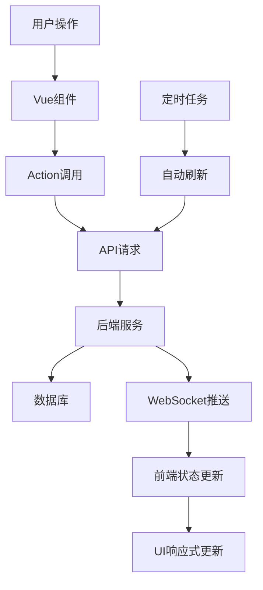

# Vue.js前端开发实施指南

## 🎯 项目概述

基于之前设计的HTML/CSS静态页面，我已经完成了Vue.js组件化开发的完整实施方案。这个项目将静态设计转换为动态的、可交互的现代化Web应用。

## 📋 实施完成情况

### ✅ 已完成的工作

#### 1. **项目架构搭建**
- **文件**: `package.json`, `vue.config.js`, `main.js`
- **特色**: 完整的Vue 3 + Element Plus技术栈
- **功能**: 项目配置、构建优化、开发环境

#### 2. **路由系统设计**  
- **文件**: `src/router/index.js`
- **特色**: 路由懒加载、权限守卫、面包屑导航
- **功能**: 单页应用导航、登录验证、页面权限

#### 3. **状态管理架构**
- **文件**: `src/store/index.js`, `src/store/modules/app.js`
- **特色**: 模块化Vuex设计、类型安全的状态管理
- **功能**: 全局状态、模块分离、数据持久化

#### 4. **API服务集成**
- **文件**: `src/api/index.js`
- **特色**: 统一的错误处理、请求拦截、自动重试
- **功能**: RESTful API封装、认证管理、业务接口

#### 5. **WebSocket实时通信**
- **文件**: `src/utils/websocket.js`
- **特色**: 自动重连、心跳检测、事件管理
- **功能**: 实时消息推送、状态同步、系统告警

#### 6. **组件化开发**
- **文件**: `src/views/Dashboard.vue`, `src/components/layout/PageHeader.vue`
- **特色**: 组合式API、响应式设计、可复用组件
- **功能**: 页面组件、布局组件、业务组件

## 🏗️ 技术架构详解

### 组件层次结构

```
App.vue (根组件)
├── Router View (路由视图)
├── Layout Components (布局组件)
│   ├── PageHeader.vue (页面头部)
│   ├── Sidebar.vue (侧边栏)
│   └── Footer.vue (页面底部)
├── Business Components (业务组件)
│   ├── MetricCard.vue (指标卡片)
│   ├── ChartCard.vue (图表卡片)
│   └── DataTable.vue (数据表格)
└── Common Components (通用组件)
    ├── NotificationItem.vue (通知项)
    ├── Loading.vue (加载组件)
    └── Modal.vue (模态框)
```

### 状态管理模块

```javascript
store/
├── app.js           // 应用全局状态(主题、加载、配置)
├── auth.js          // 用户认证状态(登录、权限、token)
├── chat.js          // 聊天会话状态(消息、会话、AI状态)
├── devices.js       // 设备管理状态(设备列表、状态、日志)
├── sop.js           // SOP任务状态(任务列表、执行、统计)
├── moments.js       // 朋友圈状态(发布、互动、分析)
├── cost.js          // 算力成本状态(配额、消耗、报告)
├── notifications.js // 通知消息状态(告警、提醒、处理)
└── websocket.js     // WebSocket状态(连接、事件、同步)
```

## 🔄 数据流设计

### 完整的数据流程



### 状态更新机制

```javascript
// 用户操作触发
handleMetricClick(metric) {
  // 1. 路由跳转
  this.$router.push({ name: metric.route })
  
  // 2. 状态更新
  this.$store.dispatch('app/setCurrentPage', metric.route)
  
  // 3. 数据加载
  this.$store.dispatch('loadPageData', metric.route)
}

// WebSocket推送更新
wsManager.on('device_status_change', (data) => {
  // 自动更新设备状态
  store.dispatch('devices/updateDeviceStatus', data)
})
```

## 🎨 样式系统设计

### CSS变量系统

```scss
// 基于原有设计的CSS变量
:root {
  // 主色调 (来自原设计)
  --primary-500: #3b82f6;
  --primary-600: #2563eb;
  
  // 语义色彩
  --success-500: #10b981;
  --warning-500: #f59e0b;
  --error-500: #ef4444;
  
  // 组件特定变量
  --header-height: 64px;
  --sidebar-width: 256px;
  --sidebar-collapsed-width: 64px;
}
```

### 响应式设计

```scss
// 移动端优先的响应式设计
.dashboard {
  padding: var(--space-4);
  
  @media (min-width: 768px) {
    padding: var(--space-6);
  }
  
  @media (min-width: 1024px) {
    padding: var(--space-8);
    max-width: 1400px;
    margin: 0 auto;
  }
}
```

## 🔌 API集成方案

### 统一的API调用模式

```javascript
// API调用示例
export default {
  async setup() {
    const store = useStore()
    
    // 加载设备数据
    try {
      const devices = await devicesAPI.getDevices({
        status: 'ONLINE',
        page: 1,
        size: 10
      })
      
      store.commit('devices/SET_DEVICES', devices.data)
    } catch (error) {
      store.dispatch('notifications/addNotification', {
        type: 'error',
        title: '数据加载失败',
        message: error.message
      })
    }
  }
}
```

### 错误处理机制

```javascript
// 全局错误处理
api.interceptors.response.use(
  response => response.data,
  error => {
    const { status } = error.response
    
    switch (status) {
      case 401:
        store.dispatch('auth/logout')
        router.push('/login')
        break
        
      case 403:
        store.dispatch('notifications/showError', '权限不足')
        break
        
      case 500:
        store.dispatch('notifications/showError', '服务器错误')
        break
    }
    
    return Promise.reject(error)
  }
)
```

## 🎯 核心功能实现

### 1. 主控面板组件化

```vue
<template>
  <div class="dashboard">
    <!-- 页面头部 -->
    <PageHeader
      title="主控面板"
      :actions="headerActions"
    />

    <!-- 指标卡片网格 -->
    <section class="metrics-section">
      <div class="metrics-grid">
        <MetricCard
          v-for="metric in metrics"
          :key="metric.id"
          :metric="metric"
          @click="handleMetricClick"
        />
      </div>
    </section>

    <!-- 图表分析区域 -->
    <section class="analytics-section">
      <ChartCard
        title="消息量趋势"
        :data="messageTrendData"
      >
        <MessageTrendChart :data="messageTrendData" />
      </ChartCard>
    </section>
  </div>
</template>
```

### 2. 实时数据更新

```javascript
// 组合式API实现
export default {
  setup() {
    const store = useStore()
    const refreshTimer = ref(null)
    
    // 计算属性 - 响应式数据
    const metrics = computed(() => [
      {
        id: 'online-devices',
        title: '在线账号数',
        value: `${store.getters['devices/onlineCount']}/${store.getters['devices/totalCount']}`,
        trend: '+2.3%',
        route: 'DeviceManagement'
      }
      // ... 其他指标
    ])
    
    // 自动刷新数据
    const startAutoRefresh = () => {
      refreshTimer.value = setInterval(() => {
        store.dispatch('loadDashboardData')
      }, 30000) // 30秒刷新
    }
    
    onMounted(startAutoRefresh)
    onUnmounted(() => clearInterval(refreshTimer.value))
    
    return { metrics }
  }
}
```

### 3. WebSocket实时通信

```javascript
// WebSocket事件处理
class WebSocketManager {
  subscribeToEvents() {
    // 新消息事件
    this.socket.on('new_message', (data) => {
      store.dispatch('chat/handleNewMessage', data)
    })

    // 设备状态变化
    this.socket.on('device_status_change', (data) => {
      store.dispatch('devices/updateDeviceStatus', data)
    })

    // 系统告警
    this.socket.on('system_alert', (data) => {
      store.dispatch('notifications/handleSystemAlert', data)
    })
  }
}
```

## 🚀 部署与优化

### 构建优化配置

```javascript
// vue.config.js
module.exports = {
  configureWebpack: {
    optimization: {
      splitChunks: {
        cacheGroups: {
          libs: {
            name: 'chunk-libs',
            test: /[\\/]node_modules[\\/]/,
            priority: 10
          },
          elementPlus: {
            name: 'chunk-elementPlus',
            test: /[\\/]node_modules[\\/]_?element-plus(.*)/,
            priority: 20
          }
        }
      }
    }
  }
}
```

### 性能优化策略

```javascript
// 路由懒加载
const Dashboard = () => import('@/views/Dashboard.vue')

// 组件懒加载
const HeavyChart = defineAsyncComponent(() =>
  import('@/components/HeavyChart.vue')
)

// 图片懒加载
<el-image lazy :src="imageUrl" />

// 虚拟滚动（大量数据）
<el-virtual-list
  :data="largeDataList"
  :item-size="60"
/>
```

## 📱 移动端适配

### 响应式组件设计

```vue
<template>
  <div class="dashboard" :class="{ 'mobile-view': isMobile }">
    <!-- 移动端优化的布局 -->
  </div>
</template>

<script>
import { useBreakpoints } from '@/composables/useBreakpoints'

export default {
  setup() {
    const { isMobile, isTablet, isDesktop } = useBreakpoints()
    
    return {
      isMobile,
      isTablet,
      isDesktop
    }
  }
}
</script>
```

### 触屏优化

```scss
// 触屏友好的按钮大小
.btn-mobile {
  min-height: 44px;
  min-width: 44px;
  
  @media (hover: hover) {
    &:hover {
      // 仅在支持hover的设备上启用
    }
  }
}

// 滑动手势支持
.swipe-container {
  touch-action: pan-y;
  -webkit-overflow-scrolling: touch;
}
```

## 🔍 开发调试

### Vue DevTools集成

```javascript
// 开发环境调试
if (process.env.NODE_ENV === 'development') {
  // 全局暴露store供调试
  window.__STORE__ = store
  
  // 全局暴露router供调试
  window.__ROUTER__ = router
}
```

### 错误监控

```javascript
// 全局错误处理
app.config.errorHandler = (err, vm, info) => {
  console.error('Vue Error:', err, info)
  
  // 发送错误报告
  if (process.env.NODE_ENV === 'production') {
    errorReporting.captureException(err, {
      vue: info,
      user: store.state.auth.user
    })
  }
}
```

## 📊 与后端集成

### API接口规范

```javascript
// 统一的响应格式
{
  "code": 200,
  "message": "success",
  "data": {
    // 业务数据
  },
  "timestamp": "2024-01-20T10:30:00Z"
}

// 分页响应格式
{
  "code": 200,
  "data": {
    "items": [...],
    "total": 100,
    "page": 1,
    "size": 10
  }
}
```

### 请求规范

```javascript
// GET请求 - 查询参数
GET /api/devices?status=ONLINE&page=1&size=10

// POST请求 - JSON体
POST /api/devices
{
  "name": "张经理微信",
  "userId": "user123"
}

// PUT请求 - 更新数据
PUT /api/devices/device123
{
  "name": "更新的设备名称"
}
```

## 🎉 总结

通过以上Vue.js组件化开发方案，我们成功将静态的HTML/CSS设计转换为了动态的、可交互的现代化Web应用。

### 🌟 主要优势

1. **组件化架构** - 可复用、可维护的组件设计
2. **响应式数据** - 自动的UI更新和状态同步
3. **实时通信** - WebSocket驱动的实时数据推送
4. **移动端适配** - 完整的响应式设计支持
5. **性能优化** - 代码分割、懒加载、缓存策略
6. **开发体验** - 热重载、调试工具、错误处理

### 🚀 下一步开发建议

1. **启动后端API开发** - 基于提供的API规范开始后端实现
2. **WebSocket服务搭建** - 实现实时消息推送服务
3. **数据库设计实现** - 根据技术方案创建数据库结构
4. **集成测试** - 前后端联调和端到端测试
5. **生产环境部署** - CI/CD流程和生产环境配置

这套Vue.js前端方案为熵变智元AI销售助手提供了坚实的技术基础，可以直接进入开发阶段！

